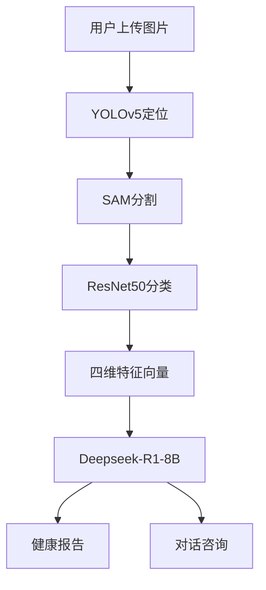

# AI舌诊助手 (AI Tongue Diagnosis Assistant) 🩺🤖

[](https://www.gnu.org/licenses/agpl-3.0)
[](https://www.python.org/)
[](https://nodejs.org/)
[](https://vuejs.org/)
[](https://fastapi.tiangolo.com/)

---

## 📜 参考说明

本项目基于 [TonguePicture-SKaRD/TongueDiagnosis](https://github.com/TonguePicture-SKaRD/TongueDiagnosis) 进行二次开发，感谢原项目的启发和基础架构支持。

### 核心改进与差异

| 类别 | 原项目 | 本项目的改进 |
|------|--------|------------|
| **推理引擎** | 固定 CPU 推理；每轮新建 SAM Predictor；无置信度过滤 | 支持 auto/cuda/cpu 模式切换；预创建并复用 SAM Predictor；增加置信度阈值过滤（`conf_threshold=0.5`） |
| **设备支持** | 仅 CPU | 通过 `TORCH_DEVICE` 配置灵活选择推理设备 |
| **模型格式** | 直接加载裸 state_dict | 支持 `checkpoint` 格式（含 `model_state_dict` 键），兼容更多训练保存方式 |
| **注意力机制** | 无 | 新增 CBAM、ECA、SE 三种注意力模块（`application/net/model/attention/`），可用于改进 YOLOv5 检测性能 |
| **Service 层** | 路由直接处理业务逻辑 | 新增完整 Service 层（`application/services/`），实现业务逻辑与路由分离，包含舌象/聊天/用户/OCR/扩展等服务 |
| **OCR 识别** | 无 | 集成 EasyOCR，支持图片文字识别（离线模式） |
| **扩展功能** | 仅舌象诊断 | 新增体检报告解读、药盒识别两大功能场景 |
| **AI 对话** | 基础聊天 | 增强的 Ollama 推理控制（thinking 模式、参数调节、流式错误处理）；新增聊天历史管理和会话列表 |
| **提示词** | 英文 | 中文中医老专家 Prompt，明确说明基于 AI 模型分析的特征 |
| **训练管线** | 无训练脚本 | 完整训练工具集：YOLOv5 训练、ResNet 分类器训练、YOLOv5+注意力机制训练、数据集检查与标注工具 |
| **训练数据** | 无 | 包含约 1000+ 张舌象标注图片（YOLO 格式） |
| **前端界面** | 基础布局 | 全新对话式交互界面（聊天主页/侧边栏/输入组件/欢迎引导）；重构登录注册页面 |
| **配置项** | 基础配置（8 项） | 大幅扩展至 15+ 项配置，涵盖设备选择、Ollama 控制、OCR 开关、场景 Prompt 等 |

### 主要新增文件一览

**后端新增：**
- `application/services/`（6 个服务文件）
- `application/net/model/attention/`（CBAM、ECA、SE 注意力模块）
- `application/routes/extra_api.py`（OCR/报告/药盒 API）

**前端新增：**
- `components/auth/NewLogin.vue`（新版登录注册）
- `components/chat/`（完整对话组件）
- `views/ChatHome.vue`（聊天主页）

**训练与工具：**
- `train_resnet.py` / `train_yolov5.py` / `train_yolov5_attention.py`
- `batch_crop_tongue.py` / `check_dataset.py` / `setup_dataset_structure.py`
- 完整训练指南文档

**数据资源：**
- 约 1000+ 张舌象原图及 YOLO 格式标注（训练/验证/测试集）
- 多个预训练/自训练模型权重文件

---

> ⚠️ **许可证说明**：本项目基于 AGPL-3.0 许可证发布。原项目代码部分同样遵循 AGPL-3.0 许可证。第三方模型（SAM、Deepseek 等）遵循其原始许可证。

> 基于深度学习的多模态舌象分析系统，集成目标检测、图像分割和大语言模型，提供智能中医舌诊服务。

---

## 📌 核心功能

### 1. 舌苔检测 (Tongue Coating Detection)
- **四维特征分析**：精确识别舌色、苔色、厚薄、腻腐
- **自动化处理流程**：`YOLOv5` 定位 → `SAM` 分割 → `ResNet50` 分类
- **智能诊断建议**：基于中医理论的健康分析和调理建议

### 2. 报告解读 (Report Interpretation)
- 体检/化验/检查报告智能解读
- OCR文字识别与关键指标提取
- 风险评估与就医建议

### 3. 药盒识别 (Medicine Box Recognition)
- 药盒/说明书OCR识别
- 药品信息提取（名称、成分、用法用量）
- 禁忌与注意事项提醒

### 4. 对话式交互
- 基于 `Deepseek-R1-8B` 的智能对话
- 自然语言问答咨询
- 多轮对话历史记录

---

## 🚀 快速开始

### 环境要求

#### 系统要求
- **操作系统**：Windows 10/11, macOS 10.15+, Linux (Ubuntu 20.04+)
- **Python**：3.12.6（推荐，已测试）或 3.9+
- **Node.js**：18.0+（推荐 24.12.0，用于前端开发）
- **npm**：11.0+（推荐 11.7.0，随Node.js安装）
- **SQLite**：3.35+（推荐 3.46.1，通常随Python安装）

#### 必需软件
- **Ollama**：[下载地址](https://ollama.com/download)
  - 用于运行本地大语言模型
  - 需要下载模型：`deepseek-r1:8b`

---

## 📦 安装步骤

### 1. 克隆仓库

```bash
git clone <repository-url>
cd TD
```

### 2. 后端环境配置

#### 2.1 创建 Anaconda 虚拟环境（推荐）

**Windows:**
```bash
# 创建 conda 环境（Python 3.12）
conda create -n AiDiagnosis-3.12 python=3.12

# 激活环境
conda activate AiDiagnosis-3.12
```

**macOS/Linux:**
```bash
# 创建 conda 环境（Python 3.12）
conda create -n AiDiagnosis-3.12 python=3.12

# 激活环境
conda activate AiDiagnosis-3.12
```

**或者使用 venv（不推荐，已弃用）：**
```bash
# Windows
python -m venv AiDiagnosis_env
AiDiagnosis_env\Scripts\activate

# macOS/Linux
python3 -m venv AiDiagnosis_env
source AiDiagnosis_env/bin/activate
```

#### 2.2 安装Python依赖

```bash
# 确保已激活环境
conda activate AiDiagnosis-3.12  # 或 source AiDiagnosis_env/bin/activate

# 安装依赖
pip install -r requirements.txt

# 安装 labelImg 和 PyQt5（用于数据标注）
pip install labelImg PyQt5==5.15.10 PyQt5-Qt5==5.15.2 PyQt5-sip==12.13.0

# 安装 segment-anything（SAM 模型）
pip install segment-anything
```

**主要依赖包：**
- `fastapi==0.110.0` - Web框架
- `uvicorn==0.28.0` - ASGI服务器
- `torch==2.2.1` - PyTorch深度学习框架
- `torchvision==0.17.1` - 计算机视觉工具
- `ultralytics==8.1.26` - YOLO目标检测
- `yolov5==7.0.13` - YOLOv5模型
- `easyocr==1.7.1` - OCR文字识别
- `SQLAlchemy==2.0.28` - ORM数据库操作
- `pydantic==2.6.3` - 数据验证
- `python-jose==3.3.0` - JWT认证
- `pillow==10.2.0` - 图像处理
- `opencv-python==4.7.0.72` - 计算机视觉库

#### 2.3 初始化数据库

数据库会在首次运行时自动创建（通过SQLAlchemy），无需手动初始化。

如果需要手动创建表结构，可以运行：
```bash
python -c "from application import create_app; from application.orm.database import engine, Base; from application.models import models; Base.metadata.create_all(bind=engine)"
```

#### 2.4 创建必要目录

```bash
# 创建模型权重目录
mkdir -p application/net/weights

# 创建图片保存目录
mkdir -p frontend/public/tongue
```

#### 2.5 下载/训练模型权重文件

需要准备以下模型权重文件到 `application/net/weights/` 目录：

**需要自己训练的模型（5个）：**
1. `yolov5.pt` - YOLOv5目标检测模型 ⚠️ **需训练**
   - 使用 `train_yolov5.py` 训练
   - 需要准备舌头检测标注数据集（YOLO格式）
2. `tongue_color.pth` - 舌色分类模型 ⚠️ **需训练**
   - 使用 `train_resnet.py --task tongue_color` 训练
   - 需要准备舌色分类数据集（5类）
3. `tongue_coat_color.pth` - 苔色分类模型 ⚠️ **需训练**
   - 使用 `train_resnet.py --task tongue_coat_color` 训练
   - 需要准备苔色分类数据集（3类）
4. `thickness.pth` - 厚薄分类模型 ⚠️ **需训练**
   - 使用 `train_resnet.py --task thickness` 训练
   - 需要准备厚度分类数据集（2类）
5. `rot_and_greasy.pth` - 腻腐分类模型 ⚠️ **需训练**
   - 使用 `train_resnet.py --task rot_and_greasy` 训练
   - 需要准备腐腻分类数据集（2类）

**预训练模型（可直接下载，无需训练）：**
6. `sam_vit_b_01ec64.pth` - SAM分割模型 ✅ **预训练模型**
   - 从 [Meta SAM官方](https://github.com/facebookresearch/segment-anything#model-checkpoints) 下载
   - 或从项目Release页面下载

**可选模型：**
7. `unet.pth` - UNet分割模型（可选，当前未使用）

**获取方式：**
- **预训练模型**：从项目Release页面下载，或从官方源下载
- **需训练模型**：参考 `QUICK_START_TRAINING.md` 和 `DATA_ANNOTATION_GUIDE.md` 进行数据准备和训练

#### 2.6 配置后端参数

编辑 `application/config/config.py`：

```python
class Settings:
    ACCESS_TOKEN_EXPIRE_MINUTES: int = 60 * 24  # Token过期时间（分钟）
    SECRET_KEY: str = "f2e1f1b1c1a1"  # JWT密钥（生产环境请修改）
    ALGORITHMS: str = "HS256"  # JWT算法
    IMG_PATH: str = "frontend/public/tongue"  # 图片保存路径
    IMG_DB_PATH: str = "tongue"  # 数据库存储路径
    OLLAMA_PATH: str = "http://localhost:11434/api/chat"  # Ollama API地址
    LLM_NAME: str = "deepseek-r1:8b"  # LLM模型名称
    APP_PORT: int = 5001  # 后端服务端口
    
    # 系统提示词（中文）
    SYSTEM_PROMPT: str = "你现在是一位精通中医舌诊的AI老中医..."
```

#### 2.7 安装并启动Ollama

1. 下载并安装 [Ollama](https://ollama.com/download)
2. 启动Ollama服务
3. 下载模型：
```bash
ollama pull deepseek-r1:8b
```

#### 2.8 启动后端服务

```bash
python run.py
```

后端将在 `http://localhost:5001` 启动。

---

### 3. 前端环境配置

#### 3.1 安装Node.js依赖

```bash
cd frontend
npm install
```

**主要依赖（实际安装版本）：**
- `vue@3.4.21` - Vue.js框架
- `vue-router@4.3.0` - 路由管理
- `pinia@2.1.7` - 状态管理
- `element-plus@2.6.1` - UI组件库
- `axios@1.8.3` - HTTP客户端
- `markdown-it@14.1.0` - Markdown渲染
- `vite@5.4.14` - 构建工具

#### 3.2 配置前端参数

编辑 `frontend/src/config/config.js`：

```javascript
export const settings = {
    ServerUrl: 'http://localhost:5001'  // 后端服务地址
};
```

#### 3.3 启动前端开发服务器

```bash
npm run dev
```

前端将在 `http://localhost:5173` 启动。

#### 3.4 构建生产版本

```bash
# 构建
npm run build

# 预览构建结果
npm run preview
```

预览服务器将在 `http://localhost:4173` 启动。

---

## 🏗️ 项目结构

```
TD/
├── .gitignore                          # Git忽略文件配置
├── LICENSE                             # 许可证文件
├── Readme.md                           # 项目文档（本文件）
├── requirements.txt                    # Python依赖列表
├── run.py                              # 后端启动入口
├── AppDatabase.db                      # SQLite数据库文件（自动生成）
│
├── (使用 Anaconda 环境，无需此目录)      # 已迁移到 Anaconda
│   # 环境名称: AiDiagnosis-3.12
│   # 环境路径: D:\Anaconda\envs\AiDiagnosis-3.12
│
├── application/                        # 后端应用目录
│   ├── __init__.py                     # 应用初始化
│   ├── config/                         # 配置模块
│   │   └── config.py                   # 全局配置
│   ├── core/                           # 核心功能
│   │   └── authentication.py           # JWT认证
│   ├── models/                         # 数据模型
│   │   ├── database.py                 # 数据库连接
│   │   ├── models.py                   # ORM模型
│   │   ├── schemas.py                  # Pydantic模式
│   │   └── create_*.sql                # SQL建表脚本
│   ├── net/                            # 深度学习模块
│   │   ├── predict.py                  # 预测主逻辑
│   │   ├── model/                      # 模型架构
│   │   │   ├── resnet.py               # ResNet模型
│   │   │   └── unet.py                 # UNet模型
│   │   └── weights/                    # 模型权重文件
│   ├── orm/                            # ORM操作
│   │   ├── database.py                 # 数据库会话
│   │   └── crud/                       # CRUD操作
│   │       ├── auth_user.py            # 用户操作
│   │       ├── chat_record.py          # 聊天记录
│   │       └── tongue_analysis.py     # 舌象分析
│   ├── routes/                         # API路由
│   │   ├── user_api.py                 # 用户API
│   │   ├── model_api.py                # 模型API
│   │   ├── extra_api.py                # 扩展功能API
│   │   └── ollama_used.py              # Ollama集成
│   └── services/                      # 业务逻辑层
│       ├── user_service.py             # 用户服务
│       ├── tongue_service.py           # 舌象服务
│       ├── chat_service.py             # 聊天服务
│       ├── extra_service.py            # 扩展服务
│       └── ocr_service.py             # OCR服务
│
├── frontend/                           # 前端应用目录
│   ├── package.json                    # 前端依赖配置
│   ├── vite.config.js                  # Vite配置
│   ├── index.html                      # HTML入口
│   ├── main.js                         # JS入口
│   ├── public/                         # 静态资源
│   │   ├── static/                     # 静态文件
│   │   └── tongue/                     # 上传的舌象图片
│   └── src/                            # 源代码
│       ├── App.vue                     # 根组件
│       ├── main.js                     # 应用入口
│       ├── router/                     # 路由配置
│       │   └── index.js
│       ├── config/                     # 配置文件
│       │   └── config.js               # 前端配置
│       ├── stores/                     # 状态管理
│       │   └── stateStore.js
│       ├── components/                 # 组件
│       │   ├── Header.vue              # 头部组件
│       │   ├── auth/                   # 认证组件
│       │   │   └── NewLogin.vue        # 登录/注册
│       │   └── chat/                   # 聊天组件
│       │       ├── ChatSidebar.vue     # 侧边栏
│       │       ├── ChatMain.vue        # 聊天主界面
│       │       ├── ChatInput.vue       # 输入框
│       │       └── WelcomeSection.vue  # 欢迎页
│       └── views/                      # 页面视图
│           ├── ChatHome.vue            # 聊天主页
│           └── LoginRegister.vue       # 登录注册页
│
└── 训练相关文件/
    ├── train_resnet.py                 # ResNet训练脚本
    ├── train_yolov5.py                # YOLOv5训练脚本
    ├── TRAINING_GUIDE.md               # 训练指南
    └── DATA_ANNOTATION_GUIDE.md         # 数据标注指南
```

---

## 🔧 配置说明

### 后端配置 (`application/config/config.py`)

| 配置项 | 说明 | 默认值 |
|--------|------|--------|
| `ACCESS_TOKEN_EXPIRE_MINUTES` | JWT Token过期时间（分钟） | `1440` (24小时) |
| `SECRET_KEY` | JWT密钥（生产环境必须修改） | `"f2e1f1b1c1a1"` |
| `ALGORITHMS` | JWT算法 | `"HS256"` |
| `IMG_PATH` | 图片保存路径 | `"frontend/public/tongue"` |
| `IMG_DB_PATH` | 数据库存储路径 | `"tongue"` |
| `OLLAMA_PATH` | Ollama API地址 | `"http://localhost:11434/api/chat"` |
| `LLM_NAME` | LLM模型名称 | `"deepseek-r1:8b"` |
| `APP_PORT` | 后端服务端口 | `5001` |
| `SYSTEM_PROMPT` | 系统提示词（舌苔检测） | 中文提示词 |
| `REPORT_SYSTEM_PROMPT` | 报告解读提示词 | 中文提示词 |
| `DRUGBOX_SYSTEM_PROMPT` | 药盒识别提示词 | 中文提示词 |

### 前端配置 (`frontend/src/config/config.js`)

| 配置项 | 说明 | 默认值 |
|--------|------|--------|
| `ServerUrl` | 后端服务地址 | `'http://localhost:5001'` |

---

## 🎯 使用指南

### 1. 启动服务

**终端1 - 启动后端：**
```bash
# 激活 conda 环境（推荐）
conda activate AiDiagnosis-3.12

# 或激活 venv 环境（已弃用）
# AiDiagnosis_env\Scripts\activate  # Windows
# source AiDiagnosis_env/bin/activate  # macOS/Linux

# 启动后端
python run.py

# 或使用批处理脚本（Windows）
启动项目.bat
```

**终端2 - 启动前端：**
```bash
cd frontend
npm run dev
```

### 2. 访问应用

打开浏览器访问：`http://localhost:5173`

### 3. 功能使用

#### 舌苔检测
1. 选择"舌苔检测"类别
2. 上传舌象图片
3. 等待AI分析（自动进行定位、分割、分类）
4. 查看诊断结果和健康建议
5. 与AI进行对话咨询

#### 报告解读
1. 选择"报告解读"类别
2. 上传报告图片或粘贴报告文字
3. 获取关键指标摘要和解读建议

#### 药盒识别
1. 选择"药盒识别"类别
2. 上传药盒/说明书图片
3. 获取药品信息和注意事项

---

## 🧩 技术架构

### 工作流程



### 技术栈

**后端：**
- **框架**：FastAPI 0.110.0
- **服务器**：Uvicorn 0.28.0
- **深度学习**：PyTorch 2.2.1
- **目标检测**：YOLOv5 7.0.13
- **图像分割**：SAM (Segment Anything)
- **分类模型**：ResNet50
- **OCR**：EasyOCR 1.7.1
- **数据库**：SQLite + SQLAlchemy 2.0.28
- **认证**：JWT (python-jose 3.3.0)

**前端：**
- **框架**：Vue.js 3.4.21
- **路由**：Vue Router 4.3.0
- **状态管理**：Pinia 2.1.7
- **UI组件**：Element Plus 2.6.1
- **构建工具**：Vite 5.4.14
- **HTTP客户端**：Axios 1.8.3
- **Markdown渲染**：markdown-it 14.1.0

**AI模型：**
- **LLM**：Deepseek-R1-8B (通过Ollama运行)
- **检测模型**：YOLOv5
- **分割模型**：SAM (Segment Anything Model)
- **分类模型**：ResNet50 (4个分类器)

---

## 📝 API文档

启动后端服务后，访问以下地址查看API文档：

- **Swagger UI**: `http://localhost:5001/docs`
- **ReDoc**: `http://localhost:5001/redoc`

### 主要API端点

#### 用户相关
- `POST /user/register` - 用户注册
- `POST /user/login` - 用户登录
- `GET /user/info` - 获取用户信息
- `GET /user/record` - 获取用户记录

#### 舌象分析
- `POST /model/upload` - 上传舌象图片
- `POST /model/chat` - 发送聊天消息
- `GET /model/record/{session_id}` - 获取会话记录

#### 扩展功能
- `POST /api/extra/report/text` - 报告解读（文本）
- `POST /api/extra/report/image` - 报告解读（图片）
- `POST /api/extra/drugbox/text` - 药盒识别（文本）
- `POST /api/extra/drugbox/image` - 药盒识别（图片）

---

## 🐛 常见问题

### 1. 端口被占用

**问题**：`[Errno 10048]` 端口已被占用

**解决**：
- 修改 `application/config/config.py` 中的 `APP_PORT`
- 或关闭占用端口的进程

### 2. Ollama连接失败

**问题**：无法连接到Ollama服务

**解决**：
- 确保Ollama服务已启动
- 检查 `OLLAMA_PATH` 配置是否正确
- 确认模型已下载：`ollama list`

### 3. 模型权重文件缺失

**问题**：`FileNotFoundError` 找不到模型文件

**解决**：
- 确保所有7个权重文件已下载到 `application/net/weights/` 目录
- 检查文件名是否正确

### 4. 前端无法连接后端

**问题**：前端请求失败，CORS错误

**解决**：
- 检查 `frontend/src/config/config.js` 中的 `ServerUrl` 是否正确
- 确认后端服务已启动
- 检查后端CORS配置（`application/__init__.py`）

### 5. 数据库错误

**问题**：数据库相关错误

**解决**：
- 删除 `AppDatabase.db` 文件，让系统自动重建
- 或手动运行数据库初始化脚本

---

## 🔒 安全注意事项

1. **生产环境配置**：
   - 修改 `SECRET_KEY` 为强随机字符串
   - 使用环境变量存储敏感信息
   - 启用HTTPS

2. **数据库安全**：
   - 定期备份 `AppDatabase.db`
   - 考虑迁移到PostgreSQL/MySQL（生产环境）

3. **API安全**：
   - 实施速率限制
   - 验证文件上传类型和大小
   - 使用更强的JWT密钥

---

## 📚 训练自定义模型

项目支持使用自己的数据训练模型，详见：

- **训练指南**：`TRAINING_GUIDE.md`
- **数据标注指南**：`DATA_ANNOTATION_GUIDE.md`
- **快速开始**：`QUICK_START_TRAINING.md`

主要训练脚本：
- `train_resnet.py` - ResNet分类模型训练
- `train_yolov5.py` - YOLOv5检测模型训练

---

## 🤝 贡献指南

欢迎贡献代码！请遵循以下流程：

1. Fork 本仓库
2. 创建特性分支 (`git checkout -b feature/AmazingFeature`)
3. 提交更改 (`git commit -m 'Add some AmazingFeature'`)
4. 推送到分支 (`git push origin feature/AmazingFeature`)
5. 开启 Pull Request

---

## 📄 许可证

本项目采用 [AGPL-3.0](LICENSE) 许可证。

第三方模型权重遵循原始许可证：
- **SAM模型**：[Apache 2.0](https://github.com/facebookresearch/segment-anything/blob/main/LICENSE)
- **Deepseek模型**：[官方许可证](https://www.deepseek.com/terms)

---

## 📞 联系方式

- **问题反馈**：[GitHub Issues](https://github.com/willgoonando/TongueAiDiagnosis/issues)
- **项目主页**：[GitHub Repository](https://github.com/willgoonando/TongueAiDiagnosis)

---

## 🎉 致谢

感谢以下开源项目的支持：
- [YOLOv5](https://github.com/ultralytics/yolov5)
- [Segment Anything](https://github.com/facebookresearch/segment-anything)
- [FastAPI](https://fastapi.tiangolo.com/)
- [Vue.js](https://vuejs.org/)
- [Element Plus](https://element-plus.org/)
- [Ollama](https://ollama.com/)

---

**最后更新**：2026年4月

